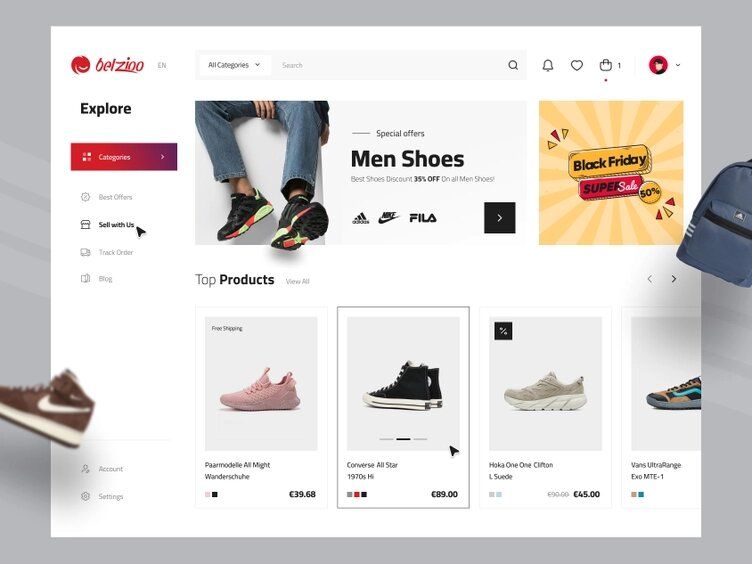

# e-commerce con React y TS (proyecto en progreso)

Aplicación que utiliza una API de propia para mostrar calzado con información detallada. Algunas de las features que tiene son:

- Proyecto en progreso
- Creado con [Vite](https://vitejs.dev).

## Scripts

- `npm install` para instalar las dependencias
- `npm run dev` para entorno de desarrollo
- `npm run build` para producción

## Licencia

MIT

## Tareas

- Proyecto en progreso
